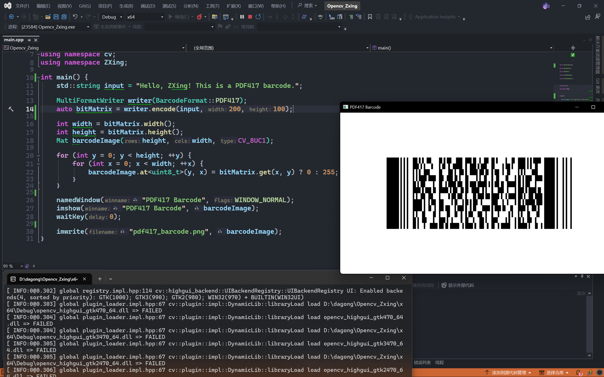

# 编译构建

需要使用到 CMake、Git、GCC 或 MSVC。

github 链接：https://github.com/zxing-cpp/zxing-cpp

编译之前请确保：

1. 确保安装了 CMake 版本 3.15 或更高版本。

2. 确保安装了与 C++17 兼容的编译器(最低VS 2019 16.8 / gcc 7 / clang 5)。

编译构建很简单，如同官网：

```txt
git clone https://github.com/zxing-cpp/zxing-cpp.git --recursive --single-branch --depth 1
cmake -S zxing-cpp -B zxing-cpp.release -DCMAKE_BUILD_TYPE=Release
cmake --build zxing-cpp.release -j8 --config Release
```

如果出错那就只能自行解决，不过不用担心，我们已经提供了编译完成的静态库。

此库不支持动态库，我们提供了 debug 和 release 两种 `.lib`。

之后就是正常的引入静态库的环境配置了，不再介绍。

## OpenCV

ZXing 理论上不依赖 OpenCV 等其它库，不过涉及图形操作，我们的第一选择基本也就是 OpenCV 了。实测 OpenCV3 与 OpenCV4 都可使用。

## OpenCV + Zxing 根据字符串生成 PDF417 条形码

```cpp
#include <opencv2/opencv.hpp>
#include <BarcodeFormat.h>
#include <BitMatrix.h>
#include <TextUtfEncoding.h>
#include <MultiFormatWriter.h>

using namespace cv;
using namespace ZXing;

int main() {
    std::string input = "Hello, ZXing! This is a PDF417 barcode.";

    MultiFormatWriter writer(BarcodeFormat::PDF417);
    auto bitMatrix = writer.encode(input, 200, 100);

    int width = bitMatrix.width();
    int height = bitMatrix.height();
    Mat barcodeImage(height, width, CV_8UC1);

    for (int y = 0; y < height; ++y) {
        for (int x = 0; x < width; ++x) {
            barcodeImage.at<uint8_t>(y, x) = bitMatrix.get(x, y) ? 0 : 255;
        }
    }

    namedWindow("PDF417 Barcode", WINDOW_NORMAL);
    imshow("PDF417 Barcode", barcodeImage);
    waitKey(0);

    imwrite("pdf417_barcode.png", barcodeImage);
}
```



实测扫码枪可以识别。如果当前环境编码存在问题，可以考虑进行编码转换，转换到 UTF-8。

我们稍微详细的来解释一下上面的代码。

1. **包含头文件**：

- 包含 OpenCV 和 ZXing 库的头文件。以及引入对应的命名空间

```cpp
#include <opencv2/opencv.hpp>
#include <BarcodeFormat.h>
#include <BitMatrix.h>
#include <TextUtfEncoding.h>
#include <MultiFormatWriter.h>

using namespace cv;
using namespace ZXing;
```

2. **输入字符串并生成 PDF417 条形码**

   - 定义一个要编码为 PDF417 条形码的字符串：

     ```cpp
     std::string input = "Hello, ZXing! This is a PDF417 barcode.";
     ```

   - 生成 PDF417 条形码：

     创建一个 `MultiFormatWriter` 对象，指定条形码格式为PDF417。

     使用 `encode` 方法将输入字符串编码为一个位矩阵（bit matrix），并指定图像的宽度和高度（200 x 100）。

     ```cpp
     MultiFormatWriter writer(BarcodeFormat::PDF417);
     auto bitMatrix = writer.encode(input, 200, 100); // 宽度和高度可以根据需要调整
     ```

3. **将条形码数据转换为 OpenCV Mat 对象：**

   - 获取位矩阵的宽度和高度。

   - 创建一个 OpenCV 的灰度图像矩阵。

   - 遍历位矩阵的每个像素点，如果为真则设为黑色（0），否则设为白色（255）

   ```cpp
   int width = bitMatrix.width();
   int height = bitMatrix.height();
   Mat barcodeImage(height, width, CV_8UC1);
   
   for (int y = 0; y < height; ++y) {
       for (int x = 0; x < width; ++x) {
           barcodeImage.at<uint8_t>(y, x) = bitMatrix.get(x, y) ? 0 : 255;
       }
   }
   ```

4. **显示条形码图像**：

   创建窗口并显示，等待用户按下任意键关闭窗口：

   ```cpp
   namedWindow("PDF417 Barcode", WINDOW_NORMAL);
   imshow("PDF417 Barcode", barcodeImage);
   waitKey(0);
   ```

5. **保存条形码为本地图像**：

   ```cpp
   imwrite("pdf417_barcode.png", barcodeImage);
   ```

## 总结

最大的问题不在于代码的理解，而是在于环境的构建。

代码本身是简单的，根据这个小例子足以修改、增加，完成许多的需求。